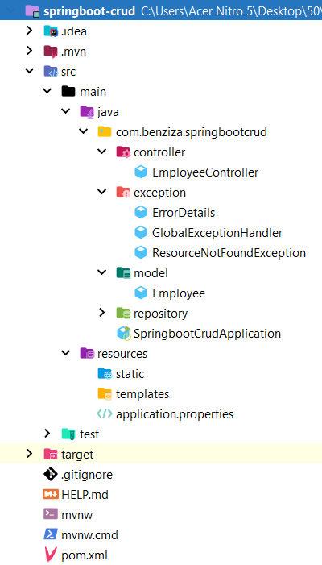

# CRUDlight-Zone-Spring-Boot-Angular-Adventure

You will develop your first FULL STACK application with Angular and Spring Boot.

## Part 1 : Spring boot

### High-level architecture of Spring boot project

### Spring Boot CRUD Rest APIs Development

### Project structure

